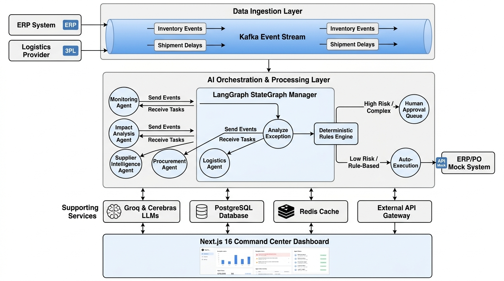
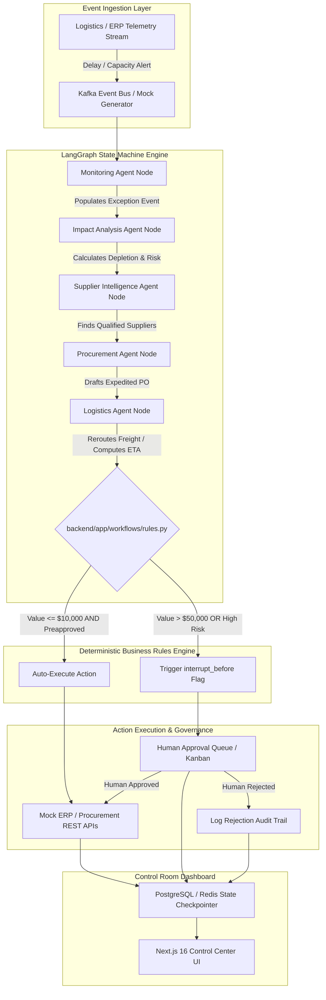

# Autonomous Supply Chain Exception Management & Procurement Agent

> An enterprise-grade, controlled multi-agent autonomous workflow engine with deterministic policy enforcement for real-time supply chain disruption detection, impact evaluation, supplier intelligence, and automated procurement execution.

---

## 1. System Overview and Engineering Philosophy

The Autonomous Supply Chain Exception Management & Procurement System is an event-driven, multi-agent control-room platform designed to detect, investigate, and mitigate supply chain disruptions in real time. The system processes streaming telemetry from Logistics and ERP systems, coordinates five specialized LLM agent nodes within a managed LangGraph state machine, evaluates risk against a pure-Python deterministic policy engine, and either automatically executes low-risk remediation actions or halts execution for human authorization on high-risk operations.

### Non-Negotiable Core Architectural Guardrail

> **Principle of Deterministic Policy Isolation:**  
> Large Language Models (LLMs) are strictly restricted to cognitive tasks: intent extraction, multi-source intelligence synthesis, unstructured text reasoning, and strategy generation. **No LLM call is permitted to evaluate financial thresholds, grant approval permissions, or make execution decisions.** All business policies, financial boundaries, and operational risk gates are implemented exclusively as pure Python code within `backend/app/workflows/rules.py` and validated by deterministic unit test suites.

---

## 2. System Architecture and End-to-End Data Flow



### End-to-End Workflow Execution Blueprint



### End-to-End Technical Execution Pipeline

1. **Ingestion & Anomaly Detection**: An incoming event (e.g., shipping delay notification or inventory depletion alert) enters the system via Kafka or an HTTP web-hook. The Monitoring Agent parses the payload, validates structural integrity, and initializes a new workflow state session.
2. **Impact & Depletion Analysis**: The Impact Analysis Agent evaluates current warehouse inventory stock levels, daily consumption rates, and bill-of-materials (BOM) requirements. It projects the exact stockout countdown horizon in days and computes financial exposure.
3. **Alternative Sourcing Search**: If stockout risk is flagged, the Supplier Intelligence Agent queries the internal supplier database to locate pre-vetted alternative vendors, checking real-time unit availability, unit pricing, and lead-time SLAs.
4. **Action Formulation**: The Procurement Agent drafts an expedited Purchase Order (PO) or modifies an existing order, while the Logistics Agent calculates optimal carrier options (e.g., switching from Ocean Freight to Air Freight) and revised delivery schedules.
5. **Deterministic Policy Validation**: The draft recommendation payload is submitted to `backend/app/workflows/rules.py`. Pure Python logic evaluates financial value, supplier preapproval status, and production impact severity.
6. **Execution or Interrupt Routing**:
   - **Low-Risk Path**: If purchase value is below $10,000 and the supplier is preapproved, the system immediately invokes the Mock ERP REST API to dispatch the PO without human intervention.
   - **High-Risk Path**: If purchase value exceeds $50,000 or production risk is critical, the state machine triggers a LangGraph `interrupt_before` signal. Workflow execution halts and persists to PostgreSQL via `MemorySaver`. The exception is published to the frontend Approval Queue Kanban board for human review.

---

## 3. LangGraph Workflow Engine and Agent Internals

### LangGraph State Schema (`SupplyChainState`)

The state machine maintains a strictly typed Pydantic state context throughout the lifecycle:

```python
from typing import TypedDict, List, Optional, Dict, Any

class SupplyChainState(TypedDict):
    exception_id: str
    event_type: str
    sku_id: str
    current_supplier_id: str
    delay_days: int
    warehouse_stock: int
    daily_burn_rate: int
    stockout_countdown_days: Optional[int]
    stockout_risk_severity: Optional[str]      # LOW, MEDIUM, HIGH, CRITICAL
    production_line_impact: Optional[str]      # LOW, MEDIUM, HIGH
    alternative_suppliers: List[Dict[str, Any]]
    selected_alternative: Optional[Dict[str, Any]]
    proposed_po_value: Optional[float]
    logistics_reroute_option: Optional[Dict[str, Any]]
    requires_human_approval: bool
    status: str                                # DETECTED, EVALUATING, PENDING_APPROVAL, EXECUTED, REJECTED
    audit_trail: List[Dict[str, Any]]
```

### Agent Node Responsibilities and LLM Boundaries

| Agent Node | Processing Focus | Cognitive Scope | Input Context | Output Attributes |
| :--- | :--- | :--- | :--- | :--- |
| **Monitoring Agent** | Signal Filtering | Normalizes telemetry payloads into structured disruption state. | Raw event payload | `exception_id`, `delay_days`, `sku_id` |
| **Impact Analysis Agent** | Risk Modeling | Infers production line impact based on depletion rate and BOM criticality. | Warehouse inventory, burn rate, delay | `stockout_countdown_days`, `stockout_risk_severity` |
| **Supplier Intelligence Agent** | Sourcing Search | Filters alternative vendors matching SLA, quality rating, and lead-time bounds. | SKU requirements, mock supplier DB | `alternative_suppliers`, `selected_alternative` |
| **Procurement Agent** | PO Formulation | Formulates order quantity, pricing, payment terms, and delivery schedules. | Selected supplier, required units | `proposed_po_value`, draft PO payload |
| **Logistics Agent** | Transport Routing | Computes freight mode trade-offs (Cost vs. Speed, Air vs. Ocean). | Origin, destination, weight | `logistics_reroute_option` |

### State Persistence and Human-in-the-Loop Mechanics

LangGraph manages state persistence through a checkpointer model (`MemorySaver` / Redis-backed checkpointer). When a workflow node flags `requires_human_approval = True`, LangGraph executes an `interrupt_before` check on the approval execution node:

- **State Serialization**: The complete `SupplyChainState` dictionary is serialized with its execution checkpoint ID and saved into persistent storage.
- **Workflow Pausing**: Thread execution terminates cleanly without blocking worker threads.
- **State Resumption**: When a human operator approves or rejects the action via the UI, the frontend dispatches a POST request to `/api/v1/workflows/resume` containing the checkpoint ID and human override decision. LangGraph reloads the exact state snapshot and resumes execution from the interrupted node.

---

## 4. Deterministic Business Policy Engine (`rules.py`)

All policy logic resides inside `backend/app/workflows/rules.py`. This file contains zero LLM dependencies and relies exclusively on deterministic Python conditionals.

### Formal Business Rules Specifications

```python
def evaluate_exception_policy(state: SupplyChainState) -> Dict[str, Any]:
    """
    Pure Python Policy Engine enforcing business governance thresholds.
    """
    delay_days = state.get("delay_days", 0)
    stockout_risk = state.get("stockout_risk_severity", "LOW")
    production_impact = state.get("production_line_impact", "LOW")
    purchase_value = state.get("proposed_po_value", 0.0)
    alternative_available = len(state.get("alternative_suppliers", [])) > 0
    supplier_info = state.get("selected_alternative", {})
    is_preapproved = supplier_info.get("is_preapproved", False)

    # Baseline Rule 1: High delay with high stockout risk requires formal case creation
    should_create_case = (delay_days > 3) and (stockout_risk == "HIGH")

    # Baseline Rule 2: Alternative supplier evaluation trigger
    should_evaluate_alt = alternative_available and (production_impact == "HIGH")

    # Baseline Rule 3: High Financial Threshold Gate (Requires Human Approval)
    human_approval_required = purchase_value > 50000.0 or production_impact == "HIGH"

    # Baseline Rule 4: Preapproval Auto-Execution Threshold
    auto_execute = (purchase_value < 10000.0) and is_preapproved and not human_approval_required

    return {
        "create_exception_case": should_create_case,
        "evaluate_alternative": should_evaluate_alt,
        "human_approval_required": human_approval_required,
        "auto_create_po": auto_execute
    }
```

---

## 5. Infrastructure Architecture and Container Topology

The application infrastructure is fully containerized using Docker Compose and organized into discrete isolated service containers connected over an internal bridge network (`orchestrate-agent_default`).

```
+-----------------------------------------------------------------------------------+
|                                Docker Host Network                                |
|                                                                                   |
|   +-----------------------+                    +------------------------------+   |
|   |  supply_chain_frontend|                    |    supply_chain_backend      |   |
|   |   (Next.js 16 / React) |                    |       (FastAPI App)          |   |
|   |     Port 3000:3000    |                    |       Port 8000:8000         |   |
|   +-----------+-----------+                    +--------------+---------------+   |
|               |                                               |                   |
|               +-----------------------+-----------------------+                   |
|                                       |                                           |
|                                       v                                           |
|   +-----------------------------------+---------------------------------------+   |
|   |                        Internal Docker Bridge Subnet                      |   |
|   |                                                                           |   |
|   |   +--------------------------+          +-----------------------------+   |   |
|   |   |   supply_chain_postgres  |          |     supply_chain_redis      |   |   |
|   |   |    (PostgreSQL 16)       |          |        (Redis 7)            |   |   |
|   |   |     Port 5432:5432       |          |      Port 6379:6379         |   |   |
|   |   +--------------------------+          +-----------------------------+   |   |
|   |                                                                           |   |
|   |   +-------------------------------------------------------------------+   |   |
|   |   |                 supply_chain_kafka (Profile: events)              |   |   |
|   |   |                      (Confluent Kafka 7.5.0)                      |   |   |
|   |   |                           Port 9092:9092                          |   |   |
|   |   +-------------------------------------------------------------------+   |   |
|   +---------------------------------------------------------------------------+   |
+-----------------------------------------------------------------------------------+
```

### Container Component Specifications

- **`supply_chain_backend`**: FastAPI ASGI server running on Python 3.11-slim. Serves REST endpoints, coordinates LangGraph agents, and connects asynchronously to PostgreSQL and Redis.
- **`supply_chain_frontend`**: Next.js 16 App Router container running Node.js 20-alpine in development mode (`next dev -H 0.0.0.0`).
- **`supply_chain_postgres`**: PostgreSQL 16 Alpine instance storing structured exception logs, supplier records, audit trails, and persisted workflow states (`postgres_data` persistent volume). Health monitored via `pg_isready`.
- **`supply_chain_redis`**: Redis 7 Alpine cache and task checkpointer (`redis_data` volume). Health monitored via `redis-cli ping`.
- **`supply_chain_kafka`**: Confluent Kafka instance running KRaft mode under the `events` profile for event stream simulation.

---

## 6. LLM Redundancy and Failover Engineering

To guarantee system availability during provider outages or rate limits, the LLM client layer (`backend/app/core/llm.py`) implements automated provider failover across identical model weights (`gpt-oss-120b`).

```
                      +-----------------------------+
                      |   Agent Node Requests LLM   |
                      +--------------+--------------+
                                     |
                                     v
                      +-----------------------------+
                      | Primary LLM Provider: Groq  |
                      |     (langchain-groq)        |
                      +--------------+--------------+
                                     |
                          Success?   |   Failure / 429 / Timeout
                        +------------+------------+
                        |                         |
                        v                         v
           +------------------------+  +--------------------------------+
           | Return LLM Response    |  | Fallback Provider: Cerebras    |
           +------------------------+  |   (gpt-oss-120b weights)       |
                                       +----------------+---------------+
                                                        |
                                             Success?   |   Failure
                                           +------------+------------+
                                           |                         |
                                           v                         v
                              +------------------------+  +------------------+
                              | Return LLM Response    |  | Raise Exception /|
                              +------------------------+  | Fallback Offline |
                                                          +------------------+
```

### Failover Algorithm Mechanics
1. **Primary Invocation**: Requests are routed first to **Groq API** for low-latency inference.
2. **Error Interception**: HTTP status codes 429 (Rate Limit), 500/503 (Server Error), or connection timeouts are intercepted by exponential backoff wrappers.
3. **Secondary Failover**: If retries fail, the system seamlessly redirects the query context to **Cerebras API** running matching model parameters.
4. **LangSmith Tracing**: Every invocation attempt, failover event, and token consumption count is logged to LangSmith when `LANGSMITH_TRACING=true`.

---

## 7. REST API Interface Specification

All backend endpoints are scoped under `/api/v1/` and typed with Pydantic request/response schemas.

### Core Endpoint Directory

| Method | Endpoint Path | Description | Access Level |
| :--- | :--- | :--- | :--- |
| `GET` | `/health` | Service health check returning DB & Redis connection status. | Public |
| `GET` | `/api/v1/dashboard/kpis` | Aggregated KPI metrics for active cases, pending approvals, and savings. | Authenticated |
| `GET` | `/api/v1/exceptions/` | List active supply chain exception cases with severity filters. | Authenticated |
| `GET` | `/api/v1/exceptions/{id}` | Detailed exception breakdown including agent outputs & audit trail. | Authenticated |
| `POST` | `/api/v1/workflows/trigger` | Ingest a new disruption event and launch LangGraph execution. | Service / ERP |
| `POST` | `/api/v1/approvals/{id}/action` | Process human operator approval or rejection decision. | Admin / Approver |
| `GET` | `/api/v1/suppliers/` | Query supplier master data, preapproval status, and capacity. | Authenticated |

---

## 8. Frontend Control Room Architecture

The frontend application is constructed as an enterprise dark-mode control room UI utilizing Next.js 16 (App Router), React 19, TypeScript 5.9 strict mode, and Tailwind CSS v4.

### Design System and Semantic Color Standards

The visual design follows strict control-room guidelines to minimize cognitive load and provide immediate spatial awareness:

- **Background Palette**: Deep charcoal / slate (`#020617` / `#0f172a` / `#1e293b`).
- **Red (Critical / High Risk)**: Stockout countdown < 7 days, unmitigated disruptions, high-impact alerts.
- **Amber (Warning / Action Required)**: Pending human approvals, shipping delays > 3 days, supplier capacity bottlenecks.
- **Green (Healthy / Auto-executed)**: Auto-approved purchase orders, preapproved vendor matches, healthy inventory telemetry.
- **Blue (Informational / In-Flight)**: Active LangGraph state machine execution, agent reasoning traces.

---

## 9. Repository Directory Layout

```
supply-chain-agent/
├── docker-compose.yml       # Docker Compose multi-container deployment manifest
├── Makefile                 # Developer CLI task automation targets
├── .env.example             # Complete environment configuration template
├── README.md                # System documentation & technical architecture reference
├── AGENTS.md                # System guidelines and rules documentation
├── docs/
│   └── images/
│       └── system_architecture.jpg   # System architecture diagram graphic
├── backend/
│   ├── Dockerfile
│   ├── requirements.txt
│   └── app/
│       ├── main.py          # FastAPI application entrypoint & middleware setup
│       ├── config.py        # Pydantic BaseSettings environment manager
│       ├── api/             # API route controllers (dashboard, exceptions, approvals)
│       ├── core/            # LLM providers, failover handling, security
│       ├── models/          # Pydantic schemas and database models
│       ├── services/        # Domain business logic services
│       ├── workflows/       # LangGraph state graph definitions & rules.py engine
│       ├── agents/          # Individual agent node definitions and prompts
│       ├── rag/             # Knowledge base embeddings & supplier contract retriever
│       └── evaluation/      # Scenario benchmark suites & performance evaluation
└── frontend/
    ├── Dockerfile
    ├── package.json
    ├── next.config.mjs
    ├── tsconfig.json
    └── src/
        ├── app/             # Next.js App Router layout and view routes
        ├── components/      # UI components (cards, drawers, tables, flow graphs)
        ├── store/           # Zustand global state stores
        ├── hooks/           # Custom React hooks
        └── types/           # Shared TypeScript interfaces
```

---

## 10. Local Setup and Verification Protocol

### Prerequisites
- Docker Desktop or Docker Engine v24+
- Make CLI utility (optional)

### Setup and Build Execution

1. **Clone Repository & Environment Setup**:
   ```bash
   git clone https://github.com/dilukshashamal/orchestrate-agent.git
   cd orchestrate-agent
   cp .env.example .env
   ```

2. **Launch Infrastructure via Docker Compose**:
   ```bash
   # Launch container stack
   make up
   
   # Or directly via Docker Compose
   docker compose up -d --build
   ```

3. **Verify Container Health**:
   ```bash
   docker compose ps
   ```

4. **Verify Health Check Endpoint**:
   ```bash
   curl -i http://localhost:8000/health
   ```
   *Expected Output*: `HTTP/1.1 200 OK` with body `{"status":"ok"}`.

5. **Access Frontend Application**:
   Navigate to `http://localhost:3000` to interact with the Next.js Command Center dashboard.

6. **Run Backend Unit Test Suite**:
   ```bash
   make test
   ```

---

## 11. Governance and Quality Verification Bar

Before any code commit or release, the following verification bar must be satisfied:

1. **Deterministic Rules Engine Testing**: Every policy logic modification requires a corresponding unit test in `backend/tests/test_rules.py` verifying both pass and fail execution branches.
2. **LangGraph Graph Compilation**: Workflow graph structure changes must compile and pass an end-to-end evaluation scenario test without unhandled state key errors.
3. **Frontend Visual Inspection**: All UI components must be visually verified in dark mode to ensure semantic color alignment and dynamic layout compliance.
