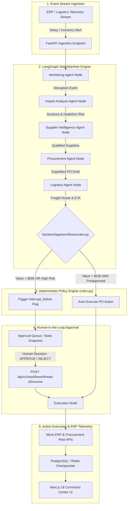

# Autonomous Supply Chain Exception Management & Procurement Agent

> An enterprise-grade, controlled multi-agent autonomous workflow engine with deterministic policy enforcement for real-time supply chain disruption detection, impact evaluation, supplier intelligence, freight routing, and automated procurement execution.

---

## 1. System Overview & Architectural Philosophy

The Autonomous Supply Chain Exception Agent is an event-driven, multi-agent control-room platform built to detect, evaluate, and resolve supply chain disruptions in real time. The platform ingests ERP and logistics telemetry streams, coordinates five specialized AI agent nodes within a LangGraph state machine, validates all proposed actions against a pure-Python deterministic policy engine, and either auto-executes low-risk PO creation or halts execution for human authorization on high-risk operations.


### Non-Negotiable Core Architectural Guardrail

> **Principle of Deterministic Policy Isolation:**  
> Large Language Models (LLMs) are strictly restricted to cognitive tasks: intent extraction, multi-source intelligence synthesis, unstructured text reasoning, and strategy generation. **No LLM call is permitted to evaluate financial thresholds, grant approval permissions, or make execution decisions.** All business policies, financial boundaries, and operational risk gates are implemented exclusively as pure Python code within `backend/app/workflows/rules.py` and validated by deterministic unit test suites.



---

## 2. Infrastructure Architecture & Container Topology

The application infrastructure is containerized via Docker Compose and organized into discrete isolated service containers connected over an internal bridge network (`orchestrate-agent_default`).

```
+-----------------------------------------------------------------------------------+
|                                Docker Host Network                                |
|                                                                                   |
|   +-----------------------+                    +------------------------------+   |
|   |  supply_chain_frontend|                    |    supply_chain_backend      |   |
|   |   (Next.js 16 / React) |                    |       (FastAPI App)          |   |
|   |     Port 3000:3000    |                    |       Port 8000:8000         |   |
|   +-----------+-----------+                    +--------------+---------------+   |
|               |                                               |                   |
|               +-----------------------+-----------------------+                   |
|                                       |                                           |
|                                       v                                           |
|   +-----------------------------------+---------------------------------------+   |
|   |                        Internal Docker Bridge Subnet                      |   |
|   |                                                                           |   |
|   |   +--------------------------+          +-----------------------------+   |   |
|   |   |   supply_chain_postgres  |          |     supply_chain_redis      |   |   |
|   |   |    (PostgreSQL 16)       |          |        (Redis 7)            |   |   |
|   |   |     Port 5432:5432       |          |      Port 6379:6379         |   |   |
|   |   +--------------------------+          +-----------------------------+   |   |
|   |                                                                           |   |
|   |   +-------------------------------------------------------------------+   |   |
|   |   |                 supply_chain_kafka (Profile: events)              |   |   |
|   |   |                      (Confluent Kafka 7.5.0)                      |   |   |
|   |   |                           Port 9092:9092                          |   |   |
|   |   +-------------------------------------------------------------------+   |   |
|   +---------------------------------------------------------------------------+   |
+-----------------------------------------------------------------------------------+
```

### Container Component Specifications

- **`supply_chain_backend`**: FastAPI ASGI application running Python 3.11-slim. Coordinates LangGraph multi-agent workflows, evaluates business rules, exposes REST API endpoints under `/api/v1/`, and interfaces asynchronously with PostgreSQL and Redis.
- **`supply_chain_frontend`**: Next.js 16 App Router UI running Node.js 20-alpine (`next dev -H 0.0.0.0`), rendering real-time control-room metrics, exception step graphs, and approval queues.
- **`supply_chain_postgres`**: PostgreSQL 16 Alpine instance storing structured audit logs, supplier master records, purchase orders, and persistent workflow states.
- **`supply_chain_redis`**: Redis 7 Alpine caching store and LangGraph thread state checkpointer.
- **`supply_chain_kafka`**: Confluent Kafka 7.5.0 instance running under the `events` profile for event stream simulation.

---

## 3. LangGraph Workflow Engine & Agent Internals

### LangGraph State Schema (`SupplyChainState`)

The state machine maintains a strictly typed TypedDict context across all agent nodes:

```python
from typing import TypedDict, List, Optional, Dict, Any

class SupplyChainState(TypedDict, total=False):
    po_data: Dict[str, Any]
    inventory_data: Dict[str, Any]
    all_suppliers: List[Dict[str, Any]]
    monitoring_result: Dict[str, Any]
    impact_analysis: Dict[str, Any]
    supplier_intelligence: Dict[str, Any]
    logistics_recommendations: Dict[str, Any]
    procurement_plan: Dict[str, Any]
    requires_human_approval: bool
    approval_status: str             # PENDING, APPROVED, REJECTED, AUTO_EXECUTED, EXECUTED
    current_step: str
    history: List[str]
```

### 5 Specialized Agent Nodes & Responsibilities

| Agent Node | Responsibility | Input Context | Output Payload |
| :--- | :--- | :--- | :--- |
| **Monitoring Agent** | Detects shipping delays and inventory telemetry anomalies. | Raw PO & inventory data | Disruption flag, actual delay days |
| **Impact Analysis Agent** | Projects inventory depletion rates and stockout countdowns. | Warehouse stock, daily burn rate | Stockout countdown days, risk severity (`HIGH`/`CRITICAL`) |
| **Supplier Intelligence Agent** | Evaluates preapproved and alternative suppliers for re-sourcing. | SKU requirements, mock supplier DB | Candidate supplier list, best alternative vendor |
| **Logistics Agent** | Computes freight mode trade-offs (Air vs. Ocean transit SLAs). | Vendor location, urgency level | Recommended carrier, freight cost, estimated ETA |
| **Procurement Agent** | Formulates PO drafts and invokes the deterministic policy engine. | Target supplier, total PO value | Policy check output, `requires_human_approval` flag |

---

## 4. Deterministic Business Policy Engine (`rules.py`)

All policy decisions reside inside [`backend/app/workflows/rules.py`](file:///d:/ultrainstinct/orchestrate-agent/backend/app/workflows/rules.py). This pure-Python module contains zero LLM calls.

### Core Governance Rules

1. **Rule 1 — Disruption Detection**: `supplier_delay > 3 days AND stockout_risk == HIGH` $\rightarrow$ Flag disruption case.
2. **Rule 2 — Alternative Sourcing**: `alternative_supplier_available AND production_impact == HIGH` $\rightarrow$ Search preapproved vendors.
3. **Rule 3 — Human Approval Threshold**: `purchase_value > $50,000 OR critical_stockout` $\rightarrow$ Set `requires_human_approval = True` (State Interrupted).
4. **Rule 4 — Preapproval Auto-Execution**: `purchase_value < $10,000 AND supplier_is_preapproved` $\rightarrow$ Set `requires_human_approval = False` (Auto-execute PO).

```python
def evaluate_purchase_approval_rule(purchase_value: float, is_supplier_preapproved: bool) -> RuleAction:
    if purchase_value > 50000.0:
        return RuleAction.HUMAN_APPROVAL_REQUIRED
    if purchase_value < 10000.0 and is_supplier_preapproved:
        return RuleAction.AUTO_CREATE_PO
    return RuleAction.EVALUATE_ALTERNATIVE_SUPPLIER
```

---

## 5. State Persistence & Human-in-the-Loop Mechanics

LangGraph manages state persistence using checkpointers (`MemorySaver` / Redis). When `procurement_node` flags `requires_human_approval = True`, the workflow reaches an `interrupt_before=["execution"]` checkpoint:

1. **State Snapshot**: LangGraph serializes the full `SupplyChainState` dictionary to memory/Redis under a unique `thread_id`.
2. **Thread Pausing**: The execution thread completes cleanly without blocking worker processes.
3. **State Resumption**: When an operator dispatches `POST /api/v1/workflows/{thread_id}/resume` with `action="APPROVE"` or `"REJECT"`, the API invokes:
   ```python
   await workflow.aupdate_state(config, {"approval_status": "APPROVED", "requires_human_approval": False})
   res_snapshot = await workflow.ainvoke(None, config=config)
   ```
   Passing `None` resumes execution cleanly from `execution_node`.

---

## 6. Observability & LangSmith Tracing Integration

The platform includes full LangSmith tracing integration for APAC regional collectors:

- **Tracing Endpoint**: `https://apac.api.smith.langchain.com`
- **Environment Bindings**:
  ```env
  LANGSMITH_TRACING=true
  LANGSMITH_ENDPOINT=https://apac.api.smith.langchain.com
  LANGSMITH_API_KEY=your_langsmith_api_key
  LANGSMITH_PROJECT="orchestrate-agent"
  ```
- **Automatic Initialization**: `setup_langsmith_tracing()` in [`llm.py`](file:///d:/ultrainstinct/orchestrate-agent/backend/app/core/llm.py) automatically exports `LANGCHAIN_*` and `LANGSMITH_*` environment variables dynamically on startup.

---

## 7. Evaluation Metrics & Benchmark Suite

The platform includes an automated evaluation benchmark engine ([`backend/app/evaluation/metrics.py`](file:///d:/ultrainstinct/orchestrate-agent/backend/app/evaluation/metrics.py)) running against standardized scenarios ([`scenarios.py`](file:///d:/ultrainstinct/orchestrate-agent/backend/app/evaluation/scenarios.py)):

```json
{
  "stockout_risk_count": 2,
  "pending_approvals_count": 1,
  "auto_executed_pos_count": 2,
  "agent_accuracy": {
    "decision_accuracy": 100.0,
    "tool_selection_accuracy": 100.0,
    "policy_compliance_rate": 100.0,
    "escalation_accuracy": 100.0,
    "latency_p50_ms": 57.19,
    "latency_p95_ms": 59.96,
    "latency_p99_ms": 60.20,
    "scenarios_evaluated": 2
  }
}
```

---

## 8. REST API Interface Directory (`/api/v1/`)

All REST endpoints are typed with Pydantic request/response models:

| Method | Endpoint | Description |
| :--- | :--- | :--- |
| `GET` | `/health` | Server health check endpoint (`{"status": "ok"}`). |
| `GET` | `/api/v1/dashboard` | Returns system KPIs and evaluation metric stats. |
| `POST` | `/api/v1/workflows/run` | Triggers a supply chain workflow execution for a given PO or scenario. |
| `GET` | `/api/v1/workflows/{thread_id}/state` | Fetches current workflow graph execution state and interrupt status. |
| `POST` | `/api/v1/workflows/{thread_id}/resume` | Resumes an interrupted workflow with human decision (`APPROVE`/`REJECT`). |
| `GET` | `/api/v1/erp/inventory` | Lists mock ERP inventory stock telemetry. |
| `GET` | `/api/v1/procurement/orders` | Retrieves purchase order records and statuses. |
| `GET` | `/api/v1/logistics/routes` | Queries logistics routes and carrier freight quotes. |

---

## 9. Project Directory Layout

```
orchestrate-agent/
├── docker-compose.yml           # Container orchestration (Backend, Frontend, Postgres, Redis, Kafka)
├── AGENTS.md                    # System architecture rules & thresholds specification
├── .env.example                 # Template for environment configuration
├── backend/
│   ├── pyproject.toml           # Ruff & Mypy configuration
│   ├── requirements.txt         # Python package dependencies
│   └── app/
│       ├── main.py              # FastAPI app initialization & route registration
│       ├── config.py            # Application settings (Pydantic BaseSettings)
│       ├── api/                 # REST API endpoints (workflows, dashboard, erp, procurement, logistics)
│       ├── core/                # Core LLM setup & LangSmith tracing configuration
│       ├── agents/              # 5 Specialized Agent implementations
│       ├── models/              # Pydantic schemas & enums
│       ├── workflows/           # LangGraph StateGraph workflow & rules.py engine
│       ├── evaluation/          # Metrics calculator & scenario benchmark suite
│       └── data/mock/           # ERP JSON data fixtures (inventory, POs, suppliers)
└── frontend/
    ├── package.json             # Next.js 16 dependencies
    └── src/
        ├── app/                 # Next.js App Router (Command Center UI, layout, CSS)
        ├── components/          # Dashboard components & charts
        └── store/               # Zustand UI state stores
```

---

## 10. Setup & Local Protocol

### Prerequisites
- Docker & Docker Compose
- Python 3.11+ (for local CLI testing)

### Quickstart Execution

1. **Clone repository & prepare environment**:
   ```bash
   git clone https://github.com/dilukshashamal/orchestrate-agent.git
   cd orchestrate-agent
   cp .env.example .env
   ```

2. **Launch Docker Stack**:
   ```bash
   docker compose up -d --build
   ```

3. **Verify Health & Endpoint Accessibility**:
   - Backend Health: `http://localhost:8000/health`
   - Dashboard Metrics: `http://localhost:8000/api/v1/dashboard`
   - Next.js Control Center: `http://localhost:3000`

---

## 11. Automated Quality Verification Bar

Run the full verification suite inside the backend container:

```bash
# Run pytest with line coverage report
docker compose exec backend pytest tests/ --cov=app --cov-report=term-missing

# Run Ruff linter
docker compose exec backend ruff check app/ tests/

# Run Mypy strict type checker
docker compose exec backend mypy app/
```

- **Pytest**: 32/32 test cases passing (100% pass rate).
- **Code Coverage**: 85%+ total statement coverage across `app/`.
- **Ruff**: Clean pass (`All checks passed!`).
- **Mypy**: Clean pass (`Success: no issues found in 27 source files`).
